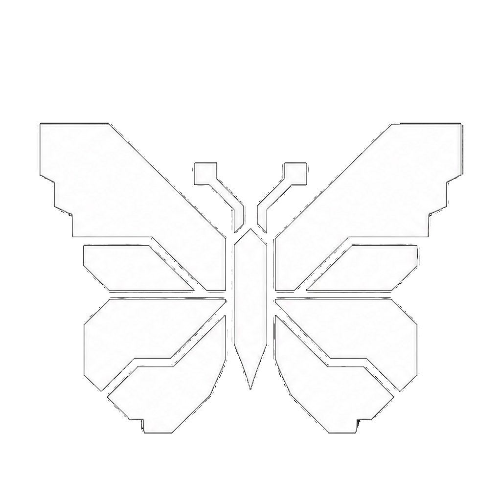

# ButterflyOS

ButterflyOS is a fast, friendly, controller-first operating system for the
Miyoo Flip V2. The first stable release is **v1.0.0**, built on the tested Alpha 2 and
v0.2.x baseline, with online updates and PortMaster support.

Download the image and matching checksum from
[the v1.0.0 stable release](https://github.com/KeatenPerkins/butterflyOS/releases/tag/v1.0.0).
Read the [build and test status](documentation/CURRENT_BUILD_STATUS.md)
and installation instructions before flashing.

Start here:

- [Quick Start](documentation/QUICK_START.md)
- [How to transfer games](documentation/TRANSFERRING_GAMES.md)
- [How to update](documentation/UPDATES.md#how-to-update)
- [Installation and recovery](documentation/BUTTERFLYOS_INSTALL_AND_RECOVERY.md)
- [Controls and hotkeys](documentation/HOTKEYS.md)
- [Features](documentation/FEATURES.md)
- [Butterfly Link save trading](documentation/BUTTERFLY_LINK.md)
- [Documentation index](documentation/README.md)
- [Compatibility matrix](documentation/BUTTERFLYOS_ALPHA_COMPATIBILITY_MATRIX.md)
- [Known issues](documentation/KNOWN_ISSUES.md)
- [v1.0.0 release notes](documentation/RELEASE_NOTES_v1.0.0.md)
- [Building from source](documentation/BUILDING.md)

Project direction is documented in the [vision](docs/VISION.md) and
[roadmap](docs/ROADMAP.md).

## Features

- Console-style ButterflyOS interface designed for a 640×480 handheld screen
- Tested defaults and Menu-button shortcuts for classic game systems
- Wi-Fi, Bluetooth controllers and audio, SSH, and themed web file transfer
- Music and compatible video playback
- HDMI video and audio output
- Combined libraries from the OS card and an optional second game card
- PortMaster in Tools for installing compatible game ports
- Online ButterflyOS updates from System Settings
- Reversible SD-card boot setup that preserves the internal Miyoo OS
- Beginner-facing settings with optional Advanced Mode
- Butterfly Link for local and same-Wi-Fi Pokémon save trades/copies across
  supported Generation I, II, and III games; see its compatibility limits

### Butterfly Link

Butterfly Link edits selected save files; it does not launch a cable-linked
game or provide battles. Same-generation local and remote trades/copies have
passed development testing. Gen II → III is a one-way copy and clears held
items. Gen I → II copies include the confirmed Gen II PC-box persistence fix. Transfers currently use PC-box Pokémon only.

Sprites are extracted and cached from the user's matching ROM. The image
contains no bundled Pokémon sprite cache, ROMs, or saves. Read the
[Butterfly Link guide](documentation/BUTTERFLY_LINK.md) before using it.

### Media compatibility on Miyoo Flip V2

The RK3566 hardware decoder supports H.264, H.265/HEVC, and VP9. H.264 is the
recommended format for the widest compatibility. AV1 is decoded in software on
this device; low-resolution AV1 may work, but high-resolution or 10-bit AV1 can
skip frames and consume substantially more battery. Container extensions such
as `.mov` do not guarantee smooth playback: high-bitrate or unusually encoded
H.264 files may also skip. Moderate-bitrate H.264/AAC at 480p or 720p is the
current safe target while hardware-decoding coverage is still being validated.

## Project status

Development currently targets only the Miyoo Flip V2. Images do not include
commercial games or proprietary console BIOS files. Users must supply content
they are legally entitled to use.

Release images are device-specific. Do not use the Miyoo Flip V2 image on a
Miyoo Flip V1, Miyoo Mini, Miyoo Mini Plus, or another RK3566 handheld.

ButterflyOS is an independent community project. It is not affiliated with or
endorsed by Miyoo, ROCKNIX, Nintendo, Sega, Sony, or any other platform owner.

## Distribution status

The Alpha 1 source baseline remains an internal test artifact because it
bundled vendor-derived preloader images. The Alpha 2 release candidate removes
those images and derives the SD-boot patch from each user's own preloader. Its
Mali stack includes the applicable EULA and avoids modifying the vendor blob;
the image excludes the proprietary DraStic package. A complete
install and exact-restore round trip passed on a second untouched Flip V2.
The October 2 release image passed host-side filesystem/content checks and a
user-confirmed boot test; the preceding image passed scraper/artwork testing.
Previous audits apply only to their recorded images; later rebuilds require a
fresh audit. See
[Known Issues](documentation/KNOWN_ISSUES.md#distribution-licensing-gate).

Release compliance status is tracked in
[Third-Party Notices](THIRD_PARTY_NOTICES.md) and the
[source and license compliance guide](documentation/SOURCE_AND_LICENSE_COMPLIANCE.md).
Each release includes a package manifest for its recorded build.

## Licenses

Original ButterflyOS software, artwork, documentation, and official identity
are covered by the scoped [ButterflyOS licensing policy](BUTTERFLYOS_LICENSE.md).
In summary, original code is GPL-2.0-or-later, general original artwork and
documentation are CC BY-SA 4.0, and the official name/logo use a separate
identity policy. Inherited and third-party works retain their own licenses.

**ROCKNIX** is a fork of [JELOS](https://github.com/JustEnoughLinuxOS/distribution/), all licenses apply and credit to the JELOS team. 

The following inherited terms describe ROCKNIX material where applicable;
they are not a single license for every component in the image. Consult the
ButterflyOS policy and each component's license for the applicable scope.

You are free to:

- Share: copy and redistribute the material in any medium or format
- Adapt: remix, transform, and build upon the material

Under the following terms:

- Attribution: You must give appropriate credit, provide a link to the license, and indicate if changes were made. You may do so in any reasonable manner, but not in any way that suggests the licensor endorses you or your use.
- NonCommercial: You may not use the material for commercial purposes.
- ShareAlike: If you remix, transform, or build upon the material, you must distribute your contributions under the same license as the original.

### ROCKNIX Software

Copyright (C) 2024-present [ROCKNIX](https://github.com/ROCKNIX)

Original software and scripts developed by the ROCKNIX are licensed under the terms of the [GNU GPL Version 2](https://choosealicense.com/licenses/gpl-2.0/).  The full license can be found in this project's licenses folder.

### Bundled Works
All other software is provided under each component's respective license.  These licenses can be found in the software sources or in this project's licenses folder.  Modifications to bundled software and scripts by the JELOS team are licensed under the terms of the software being modified.

## Credits

Like any Linux distribution, this project is not the work of one person.  It is the work of many persons all over the world who have developed the open source bits without which this project could not exist.  Special thanks to CoreELEC, LibreELEC, JELOS, and to developers and contributors across the open source community.
