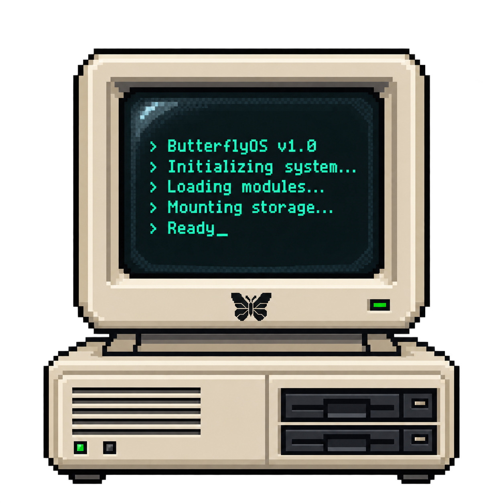
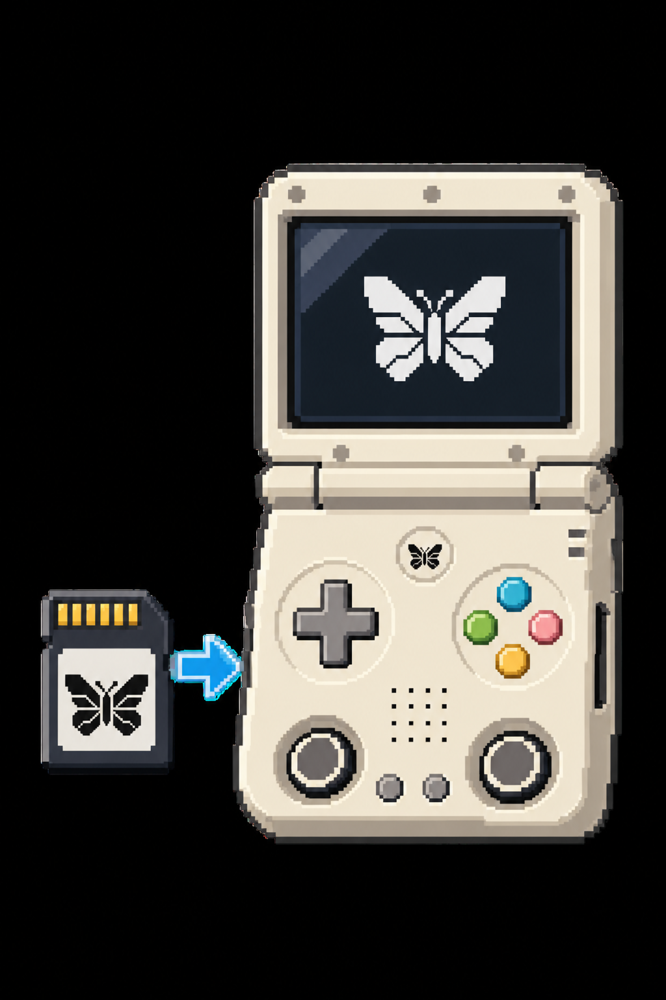
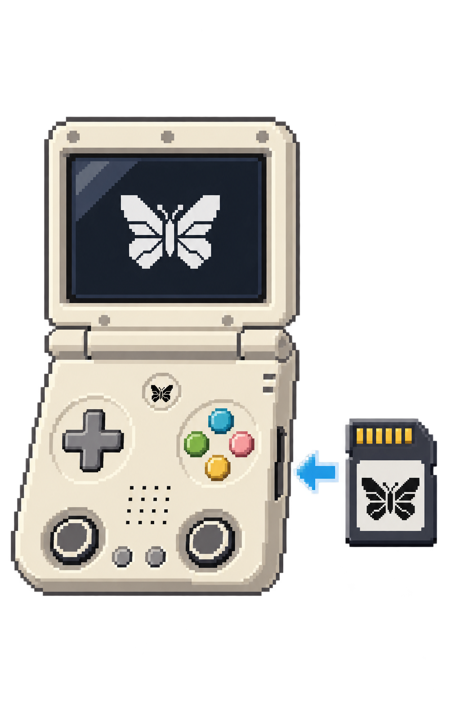

# ButterflyOS installation and recovery

ButterflyOS aims to require no disassembly during normal installation or
removal. Opening the Miyoo Flip and pressing its MASKROM button is a last-resort
recovery method, not an onboarding step.

This guide applies only to the **Miyoo Flip V2**. Use the current device-specific
image and its matching checksum from the
[v0.2.1 release](https://github.com/KeatenPerkins/butterflyOS/releases/tag/v0.2.1); see
[current build status](CURRENT_BUILD_STATUS.md).

Installation changes the internal preloader even though the OS runs from SD.
Stock system partitions are preserved; this is not a zero-write installation.
Exact reversal requires the backup from this particular device.

## Intended installation experience



1. Write the device-specific ButterflyOS image to a microSD card.
2. Leave the original Miyoo system installed internally. Put the ButterflyOS
   card in the **left-hand slot**, then start the stock Miyoo system.

   

   *First installation: left-hand slot, viewed from the front of the device.*

3. Open **Apps**, then open **ButterflyOS Setup**.
4. The first launch performs a read-only compatibility check, derives a patch
   from this unit's own preloader, and saves an exact verified backup to
   `butterflyos-recovery/` on the card. It does not write internal storage.
5. Open **ButterflyOS Setup** a second time within five minutes. The installer
   repeats every check, patches only the SPL device tree, verifies the write by
   reading it back, and powers off. Do not remove power or the card while it is
   working.
6. After shutdown, move the ButterflyOS card from the left-hand slot to the
   **right-hand slot**, then power on. The prepared card boots ButterflyOS.

   

   *Boot ButterflyOS: right-hand slot, viewed from the front of the device.*

7. In ButterflyOS, open **Tools → ButterflyOS Boot Check**. This is read-only.
8. Open **Tools → Export Recovery Backup**. In Web File Transfer,
   open **All Storage** and download both `ButterflyOS-Recovery-*.tar.gz` and
  its matching `.sha256` file to another computer or drive.

Tools is available on the home screen and through Start. Keep the device
adequately charged and use the front charging port if external power is needed.
Normal onboarding does not require a USB connection to a computer.

### If the card or Setup app is not detected

Both qualification devices occasionally failed to detect a correctly prepared
card on the first stock-OS boot, or did not show **ButterflyOS Setup** during
the first Apps scan. This did not indicate a bad image. If it happens:

1. Shut down normally through the stock OS and wait until the device is fully
   off. Never remove or reseat the card while the device is powered on.
2. Remove and firmly reseat the card in the **left-hand slot**.
3. Power on again and reopen **Apps**.
4. If Setup remains absent, repeat one normal shutdown, reseat, and cold boot.

Do not proceed if the card remains intermittent after reseating. Test the card
and use a known-good microSD card before allowing Setup to write the preloader.

The finished behavior is:

| State at power-on | Result |
|---|---|
| Compatible ButterflyOS card inserted | ButterflyOS boots from microSD |
| Card removed | Internal stock Miyoo system boots |

The installer verifies the board and SoC, exact MTD identity and size, NAND
geometry, battery or charger state, both IDB copies, and all four embedded
SHA-256 values. It verifies that DDR firmware and SPL executable code remain
unchanged, saves the device's exact original preloader and checksum before any
erase, verifies readback, retries, and restores the original after failure.
Unknown, damaged, and already-modified structures are refused.
The first public Alpha additionally uses an explicit SHA-256 allowlist of stock
preloader revisions qualified on real hardware. A structurally valid but new
revision is reported for review and is not written automatically.

The bootstrap is deliberately not automatic. It requires two separately
launched confirmations from stock within five minutes. The first launch writes
nothing internally. The second launch performs the persistent change.

## Slot summary

| Part of setup | Slot |
|---|---|
| Run **ButterflyOS Setup** from stock Apps | Left-hand slot |
| Boot and use ButterflyOS | Right-hand slot |
| Boot the stock Miyoo system after setup | Remove the ButterflyOS card |
| Optional games/media card while ButterflyOS is running | Left-hand slot |

Power off fully before moving cards. Only the OS card is imaged with ButterflyOS;
the optional game card is normally exFAT and must not be selected accidentally
when writing an OS image.

## Returning to stock boot


The stock-side installer creates these files on the ButterflyOS FAT boot
partition before changing internal storage. ButterflyOS mounts that partition
at `/flash`:

```text
butterflyos-recovery/preloader-original.img
butterflyos-recovery/preloader-original.img.sha256
```

The image must be exactly 2 MiB. The checksum file begins with its 64-character
SHA-256 value, in the same format produced by `sha256sum`. If both files are
present and valid, ButterflyOS labels the restore source **EXACT DEVICE
BACKUP**, displays its verified hash, and passes that explicit image to the
low-level restoration utility.

If either file is missing, the size is wrong, or the checksum differs,
restoration stops without writing. There is no generic fallback image.

While ButterflyOS still boots, open
**Tools → Restore Stock Miyoo Boot** and confirm. The utility validates the
selected image, proves that the installed preloader is the patch derived from
that original, writes the exact original, and verifies its readback. ButterflyOS
SD multiboot is then disabled and the
internal Miyoo system boots normally.

Restore is therefore byte-for-byte identical to what that specific device held
before installation. Without the verified device-specific pair, ButterflyOS
refuses to restore.

## Export the recovery backup before reflashing


The recovery pair initially lives on the ButterflyOS boot partition. Writing a
new whole-card image erases that partition, the storage partition, and every
copy stored on that microSD card.

Open **Tools → Export Recovery Backup**. The tool revalidates the
backup's size and SHA-256 before creating these files at the top of **All
Storage**:

```text
ButterflyOS-Recovery-<device-hash>.tar.gz
ButterflyOS-Recovery-<device-hash>.tar.gz.sha256
```

Download both files to a different physical device. Keeping the archive only
on the ButterflyOS card does not protect it from a reflash. The archive is
specific to the Miyoo Flip that created it; do not publish it, share it, or use
it on another unit.

After reflashing, verify and extract the archive on a computer. Copy the
extracted `butterflyos-recovery` folder to the root of the `BUTTERFLYOS` boot
partition. **Restore Stock Miyoo Boot** will independently check the 2 MiB
image and its SHA-256 manifest before allowing a restore.

The export protects the preloader recovery files, not your games, saves, media,
or settings. Back those up separately. If SD boot remains enabled after a
reflash, put the rewritten OS card in the right slot and boot it; the stock-side
setup does not need to be rerun. Never substitute another unit's recovery archive.

## Recovery if installation is interrupted

The installer keeps both original and derived images in RAM and retries a
failed write three times. If patched readback cannot be verified, it writes the
exact original back and verifies that readback. An interruption during the
brief erase/write window may still require RK3566 USB MASKROM recovery. If USB
MASKROM is not detected automatically, opening the shell and using the internal
MASKROM button remains the final recovery path.

The immutable SoC bootrom and MASKROM implementation are not stored in the SPI
NAND region modified by ButterflyOS.

A development recovery experiment also proved that ButterflyOS can read and
verify the complete internal NAND and can constrain a repair to an exact MTD
region. Full-NAND backup/restore is not exposed in Alpha 2; it remains a future
Advanced feature because interruption, bad-block handling, and device-specific
stock data require additional safeguards.

## Public-release gates

Do not describe onboarding as generally supported until all of these have been
tested on physical hardware:

- The stock launcher discovers `App/ButterflyOS_Setup` on the ButterflyOS boot
  partition.
- The first launch passes its full dry run, saves an exact verified backup, and
  writes nothing internally.
- The second launch derives, writes, and verifies the device-local patch.
- The read-only ButterflyOS Boot Check passes.
- Stock boots with the card removed.
- ButterflyOS boots with the card inserted.
- Restore Stock Miyoo Boot verifies successfully.
- Stock and SurwishOS boot after restoration.
- A second software-only ButterflyOS installation succeeds.

The complete round trip passed on the primary ButterflyOS Flip V2 test unit on
2026-09-01. On 2026-09-10, a second previously untouched Flip V2 completed the
device-local install, ButterflyOS/card boot, stock/no-card boot, exact restore,
and stock/card boot sequence. Independent readback after restoration matched
that unit's archived factory backup byte-for-byte. See
[`ALPHA2_ONBOARDING_QUALIFICATION.md`](ALPHA2_ONBOARDING_QUALIFICATION.md).

Qualification exposed two missing runtime interfaces. Both operations refused
before writing, and permanent fixes were package-tested. The clean rebuilt
image containing those fixes subsequently completed the same sequence without
live intervention.

## Third-party release note

The device-tree patch algorithm is derived from apommel's BaseOS implementation
and retains its MIT copyright and permission notice. ButterflyOS ships the
patch description and safety scripts, but no stock or prepatched Miyoo
preloader image. The Alpha 1 image remains an internal artifact; the clean
device-local workflow has passed physical Alpha 2 qualification.
