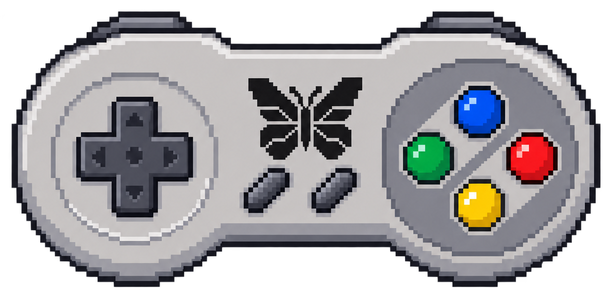

# ButterflyOS controls and hotkeys

`M` means the handheld's physical Menu button, or the button captured for a
Bluetooth controller under Controller & Bluetooth settings. These tables
describe current source defaults. Confirm them on the final release image;
the native built-in layout and external-controller command layout differ.

## RetroArch games: built-in controls, normal launch

| Input | Action |
|---|---|
| M | Open or close the RetroArch Quick Menu |
| M + Start twice | Exit the game cleanly |
| M + R2 | Save state |
| M + L2 | Load state |
| M + Right | Select the next save-state slot |
| M + Left | Select the previous save-state slot |
| M + R1 | Toggle fast-forward |
| M + L1 | Rewind when supported and enabled |
| M + X | Toggle the FPS display |
| M + Up | Increase screen brightness |
| M + Down | Decrease screen brightness |

Press Start twice while continuing to hold M. The two presses must occur close
together; this protects against accidental exits. A clean exit creates the
normal resume point. Manual save states retain a rolling history.

Fast-forward and rewind support can vary by emulator and game. Rewind consumes
additional memory and is not enabled for every system.

## Bluetooth controllers

1. Enable Bluetooth and connect the controller.
2. Return to **Controller & Bluetooth Settings** if necessary.
3. Choose **Set Controller Menu Button**.
4. Press the desired controller button three times before the eight-second
   timer expires.
5. Use **Test Controller Menu Button** to verify it.

The saved button acts as M. The mapping persists after
reboot and reconnection. If the Player 1 Bluetooth controller disconnects,
ButterflyOS returns Player 1 control to the built-in controls after device
detection completes.

The current tested 8BitDo SN30 Pro+ Xbox-mode external shortcut handler uses:

| Input | Action |
|---|---|
| M alone, then release | Toggle Quick Menu |
| M + R1 | Save state |
| M + L1 | Load state |
| M + R2 | Toggle fast-forward |
| M + L2 | Rewind |
| M + Right / Left | Next / previous state slot |
| M + Start twice | Exit cleanly |

After an externally controlled session falls back to the built-in pad, its
command handler also uses **R1/L1 for save/load** and **R2/L2 for fast-forward/
rewind**. This differs from normal built-in launches above. Capturing Menu does
not learn every other button's raw event code; arbitrary controller models and
modes require qualification. Four-controller ordering and multiplayer are not
yet qualified. Do not assume universal mappings.

## Standalone-emulator exceptions

Not every standalone emulator uses RetroArch's Quick Menu or save-state
commands. Alpha 2 adds the clean Menu+Start-twice exit gesture to YabaSanshiro
(Saturn) and OpenBOR. PPSSPP retains its native menu and exit behavior.

If a standalone application does not recognize a shortcut, use its native menu
where available. Report the emulator, controller, and shortcut involved.

## Media player

| Input | Action |
|---|---|
| A | Pause or resume playback |
| R1 | Play the next track in the current folder |
| L1 | Play the previous track in the current folder |
| Right / Left | Seek forward or backward 5 seconds |
| Up / Down | Seek forward or backward 60 seconds |
| B or Menu | Stop playback and return to Media |

Use the handheld's volume rocker to adjust volume.

Opening an audio file automatically queues the other audio tracks in that
folder. Playback advances to the next track when a song ends. After the final
track, playback stops and returns to Media; the folder does not loop forever.

## Home screen and Butterfly Link

- **Start** opens Main Menu; selecting **Settings** opens the same menu.
- **Select** opens the shutdown menu. Confirm shutdown before removing a card.
- **Tools** opens the tool list directly; it is also available from Main Menu.
- Butterfly Link: D-pad navigates, **A/Start** selects, **B/Menu** goes back.
  Long notices in the next build can be scrolled with Up/Down.
