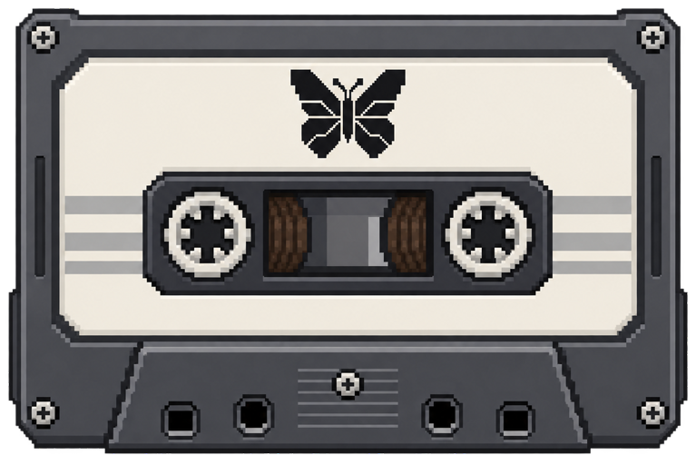

# ButterflyOS Quick Start

**ATTENTION**

Your Miyoo Flip V2 comes with Miyoo's original operating system installed inside the
console. A small startup program, called the **bootloader** (or **preloader**),
tells it where to find the system when you turn it on.

To let it start ButterflyOS from an SD card, ButterflyOS Setup makes a small
change to that startup program. It keeps the original Miyoo operating system installed:
with the ButterflyOS card removed, the console can still start Miyoo's operating system.

**Before making that change, Setup saves a copy of your device's original
preloader and a checksum.** The checksum lets the recovery tool check that the
backup is intact. This backup is what lets you undo the change and return to
stock Miyoo boot behavior. Installation and restoring the original preloader
have been tested on real Flip V2 devices, using their verified backups.


**Do not skip exporting your recovery backup.** After your first ButterflyOS
boot, open **Tools → Export Recovery Backup** and follow the download steps
below. Keep both the exported archive and its `.sha256` checksum on your PC or
another safe drive. A copy left only on the SD card can be lost if that card
fails or is formatted. Keep each device's backup clearly labeled.


If you want to undo the setup, **Tools → Restore Stock Miyoo Boot** uses your
verified original backup. **Keep that backup even if everything works today—
it is your way back if you need recovery later.**

**Switching to another operating system?** It may work with the ButterflyOS
preloader change still installed, but another OS may expect the original Miyoo
preloader. We strongly recommend using **Tools → Restore Stock Miyoo Boot**
before switching away from ButterflyOS, then following the new operating
system's installation instructions.

ButterflyOS supports the **Miyoo Flip V2 only**. Back up saves and other
important files before installation or reflashing.

Read [current build status](CURRENT_BUILD_STATUS.md) before testing. Download
the image and matching checksum from the
[latest stable release](https://github.com/KeatenPerkins/butterflyOS/releases/latest).

## What you need

- A Miyoo Flip V2
- A reliable microSD card and card reader
- The Miyoo Flip V2 ButterflyOS `.img.gz` release file
- Its matching `.sha256` file
- A computer capable of writing disk images

ButterflyOS does not contain games or proprietary console BIOS files.

## Verify the download

Keep the downloaded image and its matching checksum file in the same directory.
Run this command from that directory on Linux:

```sh
sha256sum -c ButterflyOS-*-Miyoo-Flip-V2.img.gz.sha256
```

The result must say `OK`. If it does not, delete the download and obtain it
again. Windows users can compare the value reported by `Get-FileHash` in
PowerShell with the value inside the `.sha256` file.

## Write the card

Use a graphical image writer such as Raspberry Pi Imager, balenaEtcher, or
another tool that accepts compressed `.img.gz` images.

1. Insert the microSD card.
2. Select the ButterflyOS `.img.gz` image.
3. Select the microSD card as the destination.
4. Check the destination capacity and model carefully. Writing the image
   erases the selected drive completely.
5. Write and verify the image, then eject the card safely.

The card initially contains a 2 GiB `BUTTERFLYOS` partition and a small
`STORAGE` partition. The storage partition expands automatically on first boot.

`BUTTERFLYOS` is the FAT boot partition; `STORAGE` is ext4 user storage. Windows
and macOS do not normally mount ext4 without additional tools. Do not accept a
computer's prompt to format an unfamiliar partition. Use Web File Transfer
after booting the Flip, or mount the data partition on a Linux computer.

## First-time device setup

ButterflyOS uses a reversible SD-boot setup while leaving the stock Miyoo OS
installed internally.

This is for a stock Flip V2 that has not already had ButterflyOS SD boot enabled.
Keep the device adequately charged; use the front charging port for external
power. The rear USB port is not the charging port.

1. Put the prepared card in the **left-hand slot**.

   

   *Left-hand slot, viewed from the front of the device.*

2. Boot the stock Miyoo OS and open **Apps → ButterflyOS Setup**.
3. Read the warning. Launch **ButterflyOS Setup** a second time within five
   minutes to confirm.
4. Do not remove power or the card while the setup runs.
5. After the device powers off, move the card to the **right-hand slot**.

   

   *Right-hand slot, viewed from the front of the device.*

6. Boot ButterflyOS and allow first-boot initialization to finish.
7. Open **Tools → ButterflyOS Boot Check**. Tools is on the home screen and
   also in the Start main menu.
8. Open **Tools → Export Recovery Backup**, then download the
   resulting archive and `.sha256` file to another computer. Do this before
   ever reflashing the ButterflyOS card.

If the stock OS does not detect the card or does not initially show
**ButterflyOS Setup**, shut down normally, wait until fully powered off, reseat
the card in the left slot, and cold boot again. This was occasionally necessary
on both qualification devices. Never reseat the card while powered on. If it
remains intermittent, stop and test or replace the card before running Setup.

Afterward, the device boots ButterflyOS when its card is inserted and boots the
stock Miyoo OS when the card is removed. Read the complete
[installation and recovery guide](BUTTERFLYOS_INSTALL_AND_RECOVERY.md) before
starting, especially the current exact-restoration and licensing caveats.

## Add games and BIOS files

See [How to transfer games](TRANSFERRING_GAMES.md) for step-by-step web uploads,
SD-card copying, SMB, SFTP/SCP, and rsync instructions.

Copy legally obtained games into `STORAGE/roms/<system>` (shown on-device as
`/storage/roms/<system>`). Common aliases such
as `roms/FC` and `roms/SFC` are recognized alongside `roms/nes` and
`roms/snes`.

Place user-supplied BIOS files in `STORAGE/roms/bios`. Open **Tools → System
Manager** to see which systems are ready and which BIOS files are missing.

If files are copied while ButterflyOS is running, open the game settings and
choose **Update Gamelists**. Systems appear only when recognized games are
present.

Use a matching basename for ordinary game saves: for example,
`Pokemon - Gold Version (USA, Europe).gbc` and
`Pokemon - Gold Version (USA, Europe).srm`. Emulator save states are separate
from in-game/battery saves. See [Butterfly Link](BUTTERFLY_LINK.md) before
transferring Pokémon.

## Optional second game card

ButterflyOS can combine games stored on the OS card with games on a second SD
card. With ButterflyOS on the right, the game card goes in the left slot.
Power off before inserting or removing it. Open **Tools → Format 2nd SD
Card**. Despite its name, the tool can inspect a compatible card, keep existing
files and create the expected folders, or
format it as exFAT after two destructive-action confirmations.

Add games beneath `roms/<system>` on that card and choose **Update Gamelists**.
Games from both cards appear together. If both cards contain a file with the
same system and filename, the OS-card copy takes precedence. The second card is
also available as **Second Game Card** in Web File Transfer.

exFAT is the recommended second-card format. The mounting code also supports
FAT32, NTFS, ext4, and btrfs, but these alternatives have not all received the
same hardware testing. The OS card remains the image's FAT+ext4 layout.

## Add music and videos



On the OS card, use `STORAGE/media/Music` and `STORAGE/media/Videos`.
The Music/Videos links in Web File Transfer select these folders for you.
On a second card, use `roms/music` and `roms/videos`; library refresh includes
those files under Media. Older OS-card `roms/music` and `roms/videos` files
are imported into the `media` folders during refresh.

Media remains available even when empty. Refresh after uploads if new files
are not yet listed. H.264/AAC at moderate 480p/720p bitrates is the recommended
video target; a `.mov` or `.mkv` extension alone does not guarantee smooth playback.

## Network transfer

Open **Settings → Network Settings**, enable Wi-Fi, choose **Select Wi-Fi Network**,
and enter the network password. Submit with the keyboard's on-screen Enter
button; B is a back/cancel control, not a substitute for submitting the value.

Choose **Set SSH Password** and submit the new device password before enabling
SSH or Web File Transfer. In Web File Transfer, open the displayed web address
on another device on the same network. The login name is `root` and the
password is the one you set; do not assume a development test password.

For SSH, use `ssh root@<device-IP>` with the IP shown in Network Settings.
The default hostname is `butterflyos`; two Flips can share that default, so use
their displayed IPs when connecting to more than one. Local hostname resolution
depends on your network. Bluetooth controllers are managed in
**Settings → Controller & Bluetooth Settings**.

## Safe shutdown

Use **Select → Shut Down System**, or **Start → Quit → Shut Down System**,
and wait for the device to power off
before removing the card. See [Controls and hotkeys](HOTKEYS.md) for in-game
exit and save-state shortcuts.

Closing the lid blanks the LCD but does not suspend the game or system.
Use shutdown for long breaks; the CPU and networking continue drawing power
with the lid closed.

## Updating a test installation

Follow [How to update](UPDATES.md#how-to-update). Allow at least **3 GB free on
the OS card**, or more if the updater requests it. Connect Wi-Fi and front-port
power, and charge to at least 50%. Wait for **Update is ready / Reboot to apply**,
then choose **Start → Quit → Restart System** to install. After boot, compare
the installed version with the updater build identity in the
[latest release notes](https://github.com/KeatenPerkins/butterflyOS/releases/latest) and check your games
and saves. Original v0.2.1 installations need the migration fix explained in
the update guide before using online updates.

If you need to reflash instead, reflashing erases games, saves, settings, and
the recovery backup on that card. Export the
device recovery archive and separately back up all user files first. The SD-boot
change stays in the device's internal preloader; do not reinstall it merely
because you rewrote the OS card. Restore the correct device's recovery folder
to the new boot partition as described in the installation guide.

## Lid-closed shutdown

Closing the lid turns off the display; the system continues running.
In **System Settings → Hardware → Lid-Closed Shutdown**, choose Off (the default),
15, 30, or 60 minutes. Reopening the lid resets the countdown.

With **Save Game Before Lid Shutdown** off (the default), return to the
menu before closing the lid. Running games and tools defer shutdown.

Enable **Save Game Before Lid Shutdown** to let supported RetroArch games
save their current position when the timer expires. ButterflyOS requests a
fresh auto-save, verifies that the complete file was written, exits RetroArch
normally, then uses normal system shutdown to save frontend metadata.
This replaces the game's auto-save, keeps its previous file as
`.state.auto.lid-backup`, and leaves numbered manual slots unchanged.
Choose **Auto Save** in the Save State Manager to resume after booting.
The backup is the previous auto-save, not an extra entry in that menu.

If the emulator does not support this operation, the command connection fails,
or a complete new save cannot be verified, the game stays running and shutdown
is deferred. Other emulators and active tools also defer shutdown. Save-state
creation remains subject to the core's support and RetroAchievements restrictions.
