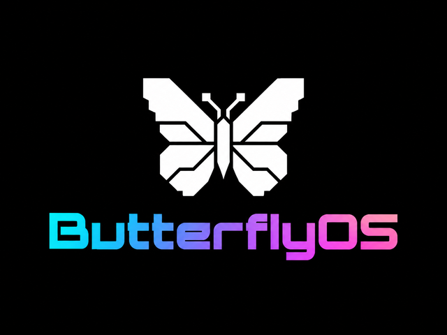

# ButterflyOS documentation

ButterflyOS currently targets the Miyoo Flip V2 only. The full installation
image is available from the
[v1.0.0 release](https://github.com/KeatenPerkins/butterflyOS/releases/tag/v1.0.0).
The stable release includes both a fresh-install image and an online update
package for installations with the corrected updater. Read [How to update](UPDATES.md#how-to-update) for
version requirements, download instructions, and the older-build migration.

## For users and testers

- [Quick Start](QUICK_START.md): download verification, card writing, first
  setup, adding files, and shutdown.
- [How to transfer games](TRANSFERRING_GAMES.md): web uploads, SD-card copying,
  SMB, SFTP/SCP, rsync, and device password setup.
- [Installation and recovery](BUTTERFLYOS_INSTALL_AND_RECOVERY.md): the
  device-specific SD-boot change, backup export, reflashing, and exact restore.
- [Features](FEATURES.md): current capabilities and their limits.
- [How to update](UPDATES.md#how-to-update): free SD-card space, downloading,
  verification, restarting to install, and checking the new version.
- [Controls and hotkeys](HOTKEYS.md): built-in controls, Bluetooth differences,
  and media playback.
- [Butterfly Link](BUTTERFLY_LINK.md): local/remote save transfers and supported
  generation directions.
- [Known issues](KNOWN_ISSUES.md): incomplete testing and reported failures.
- [Compatibility matrix](BUTTERFLYOS_ALPHA_COMPATIBILITY_MATRIX.md): tested
  systems, sample titles, emulator choices, and exceptions.
- [Current build status](CURRENT_BUILD_STATUS.md): existing image versus
  changes staged for the next build.
- [v1.0.0 release notes](RELEASE_NOTES_v1.0.0.md): release scope and
  publication status.

## For builders and maintainers

- [Release procedure](RELEASE_PROCEDURE.md)
- [Building](BUILDING.md)
- [Source and license compliance](SOURCE_AND_LICENSE_COMPLIANCE.md)
- [Third-party notices](../THIRD_PARTY_NOTICES.md)
- [Release audit](PUBLIC_RELEASE_AUDIT.md)
- [Legal release checklist](LEGAL_RELEASE_CHECKLIST.md)
- [Onboarding qualification](ALPHA2_ONBOARDING_QUALIFICATION.md)
- [Roadmap](../docs/ROADMAP.md)

Package manifests, dated test reports, and older link-cable design documents
are historical development records. They do not establish that a newer image
passed the same checks. In particular, the older netplay/USB Butterfly Link
plans do not describe the current save-transfer app.

Inherited `PER_DEVICE_DOCUMENTATION` directories for other chipsets describe
upstream ROCKNIX, not ButterflyOS support for those devices. Only the Miyoo
Flip V2 image is the current ButterflyOS target.
